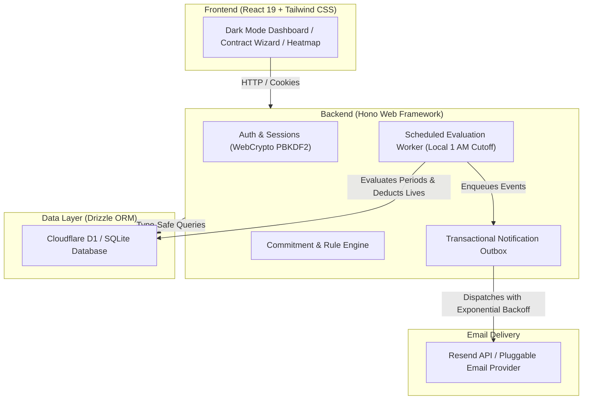

# Commitment — Accountability Contract Application

> **Make a promise. Define the rules. Give someone visibility. Prove your progress. Face the consequence.**

Commitment is a digital accountability contract platform where users enter enforceable, measurable agreements with accountability partners. Commitments feature customizable rules, deadlines, lives, recovery mechanics, proof submissions, scheduled evaluation, and transactional notifications.

---

## 1. Architecture Overview

Commitment is architected as a clean, low-cost modular monolith deployable directly to **Cloudflare Pages / Workers** with **Cloudflare D1** or locally via **SQLite / Node / Bun**.



---

## 2. Core Domain & Business Rules

1. **Deterministic Accountability**:
   - Every commitment defines an initial life count (e.g. 3 lives `♥ ♥ ♥`), a target (e.g. 2 LeetCode problems / 5 km / 20 pages), frequency (Daily or Weekly), and an accountability partner.
   - **No Self-Approval**: A creator cannot partner or approve their own contract.
   - **Immutable Terms**: Once accepted by the accountability partner, contract rules become immutable.

2. **Timezone-Aware Evaluation**:
   - Each commitment operates in the user's local timezone (e.g. `Asia/Kolkata`, `America/New_York`).
   - Cutoff: Local `00:00` midnight.
   - Evaluation: Local `01:00` AM scheduled run.

3. **Consequences & Life Restoration**:
   - **Miss**: Failure to complete the target before cutoff deducts the configured lives (e.g. -1 life), resets the streak to 0, and notifies both creator and partner.
   - **Recovery**: Consecutive successful days (e.g. 5 days) restore +1 life, capped at `max_lives`.
   - **Termination**: If lives reach 0, the contract transitions to `FAILED`.

4. **Transactional Outbox Pattern**:
   - Evaluation records `notification_events` inside the database transaction.
   - Workers dispatch emails with exponential backoff retries (1m, 5m, 30m) and idempotency guards.

---

## 3. Tech Stack

- **Frontend**: React 19, TypeScript, Vite, Tailwind CSS, Lucide Icons, React Router v7.
- **Backend**: Hono, Drizzle ORM.
- **Database**: Cloudflare D1 (production) / SQLite (development).
- **Security**: WebCrypto PBKDF2-SHA256 password hashing, secure HTTP-only cookies, session tokens, rate limiting.
- **Testing**: Vitest test suite.

---

## 4. Quickstart & Local Development

### Prerequisites
- Node.js 20+ or Bun 1.1+

### Installation
```bash
# Clone and enter repository
git clone https://github.com/hiteshprajapati/commitment.git
cd commitment

# Install dependencies
bun install   # or npm install
```

### Database Setup & Seed
```bash
# Run schema migrations
bun run db:migrate

# Seed development users ('hitesh' & 'rahul', password: 'password123')
bun run db:seed
```

### Run Development Server
```bash
# Start Vite development server
bun run dev

# Or start the unified server at http://localhost:3000
bun run server
```

### Run Test Suite
```bash
bun run test
```

---

## 5. Cloudflare D1 & Production Deployment

### 1. Create Cloudflare D1 Database
```bash
npx wrangler d1 create commitment-db
```
Copy the generated `database_id` into your `wrangler.toml`:
```toml
[[d1_databases]]
binding = "DB"
database_name = "commitment-db"
database_id = "YOUR_DATABASE_ID_HERE"
```

### 2. Apply Migrations to Remote D1
```bash
npx wrangler d1 execute commitment-db --file=./drizzle/0000_initial_schema.sql --remote
```

### 3. Deploy Worker & Static Assets
```bash
# Build frontend
bun run build

# Deploy to Cloudflare Workers
npx wrangler deploy
```

---

## 6. Environment Variables

Create a `.env` file based on `.env.example`:

| Variable | Description | Example |
| :--- | :--- | :--- |
| `DATABASE_URL` | Local SQLite database path | `./local.db` |
| `SESSION_SECRET` | Secret key for session encryption | `random_secret_32_characters` |
| `RESEND_API_KEY` | Resend API key for email delivery | `re_123456789` |
| `EMAIL_FROM` | Sender address for notifications | `Commitment <notifications@commitment.app>` |
| `CRON_SECRET` | Secret header for external webhook triggers | `cron_secret_auth_key` |

---

## 7. Security & Authorization Guardrails

- **Session Ownership**: All mutations derive the active user from verified server-side session cookies.
- **Contract Privacy**: Non-participants cannot view or mutate contracts they are not part of.
- **Proof Integrity**: Only the contract creator can submit daily proof.
- **Zero Plaintext Secrets**: Passwords are never stored in plaintext or logged.

---

## 8. App Screenshot

